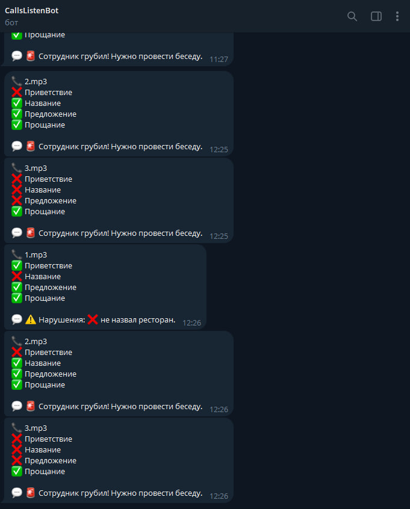

# CallMonitor — Автоматический контроль качества звонков с ИИ

## 📌 Задача бизнеса
Владельцу кальянной нужно автоматически контролировать качество работы администраторов при общении с клиентами по телефону. Ручная прослушка звонков занимает часы, не даёт статистики и не позволяет отследить динамику нарушений.

## 🛠 Что сделано
Разработана полностью автоматическая система анализа телефонных звонков:

| Модуль | Технологии | Что делает |
|--------|------------|------------|
| Распознавание речи | faster-whisper | Превращает аудиозвонок в текст |
| Анализ текста | Ollama + Qwen 2.5 (локальная LLM) | Оценивает звонок по 4 критериям: приветствие, название ресторана, предложение доп. услуг, прощание |
| Хранение | PostgreSQL | Сохраняет историю всех звонков с результатами анализа |
| Уведомления | Telegram Bot API | Отправляет отчёт по каждому звонку |
| Автоматизация | Планировщик Windows (schtasks) | Запускает обработку каждые 30 минут |
| Панель администратора | Streamlit | Дашборд с историей, фильтрами и статистикой по сотрудникам |
| Установка | setup.bat (одна команда) | Автоматически настраивает всё окружение (Python, Ollama, модель, планировщик) |

## 📊 Результат

✅ Звонки анализируются без участия человека  
✅ Отчёты приходят в Telegram после каждого звонка  
✅ Дашборд с историей, фильтрацией и графиками нарушений (опционально)  
✅ Все данные хранятся в PostgreSQL с историей  (опционально)
✅ Работает полностью локально (никакие записи не уходят в облако)  
✅ Установка одной командой — клиент ничего не настраивает вручную  
✅ Поддержка нескольких сценариев оценки (меняется в 5 минут)

## 🖼 Скриншоты

| Telegram-отчёт |
|----------------|------------------------|-------------------|
|  |

## 🚀 Демонстрация  
Запустите `setup.bat` от имени администратора (один раз), затем положите аудиофайлы в `data/incoming/`.

## 💰 Стоимость аналогичного решения под ваш бизнес
Точная цена зависит от количества звонков, нужных критериев оценки и необходимости интеграции с вашей телефонией.
